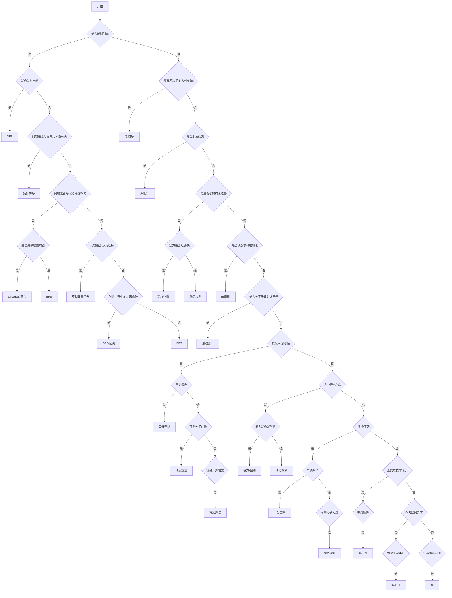

```mermaid
graph TD
    A[开始] --> B{是否是图问题}
    B -->|是| C{是否是树问题}
    C -->|是| D[DFS]
    C -->|否| E{问题是否与有向无环图有关}
    E -->|是| F[拓扑排序]
    E -->|否| G{问题是否与最短路径相关}
    G -->|是| H{是否是带权重的图}
    H -->|是| I[Dijkstra's 算法]
    H -->|否| J[BFS]
    G -->|否| K{问题是否涉及连接}
    K -->|是| L[不相交集合并]
    K -->|否| M{问题中有小的约束条件}
    M -->|是| N[DFS/回溯]
    M -->|否| O[BFS]
    B -->|否| P{需要解决第 k 大/小问题}
    P -->|是| Q[堆/排序]
    P -->|否| R{是否涉及链表}
    R -->|是| S[双指针]
    R -->|否| T{是否有小的约束边界}
    T -->|是| U{暴力是否足够快}
    U -->|是| V[暴力/回溯]
    U -->|否| W[动态规划]
    T -->|否| X{是否涉及求和或加法}
    X -->|是| Y[前缀和]
    X -->|否| Z{是否关于子数组或子串}
    Z -->|是| AA[滑动窗口]
    Z -->|否| AB{找最大/最小值}
    AB -->|是| AC{单调条件}
    AC -->|是| AD[二分查找]
    AC -->|否| AE{可划分子问题}
    AE -->|是| AF[动态规划]
    AE -->|否| AG{贪婪计算答案}
    AG -->|是| AH[贪婪算法]
    AB -->|否| AI{询问多种方式}
    AI -->|是| AJ{暴力是否足够快}
    AJ -->|是| AK[暴力/回溯]
    AJ -->|否| AL[动态规划]
    AI -->|否| AM{多个序列}
    AM -->|是| AN{单调条件}
    AN -->|是| AO[二分查找]
    AN -->|否| AP{可划分子问题}
    AP -->|是| AQ[动态规划]
    AM -->|否| AR{查找或枚举索引}
    AR -->|是| AS{单调条件}
    AS -->|是| AT[双指针]
    AR -->|否| AU{"O(1)"空间要求}
    AU -->|是| AV{涉及单调条件}
    AV -->|是| AW[双指针]
    AU -->|否| AX{需要解析符号}
    AX -->|是| AY[栈]
    
```