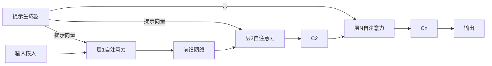

### **一、P-Tuning 的核心原理**
#### **1. 基本思想**
P-Tuning 通过引入**连续可学习的提示向量（Continuous Prompt）**，在不修改预训练模型参数的前提下，仅优化这些提示参数来适配下游任务。其核心创新在于：

- **深度提示注入**：提示向量作用于多个 Transformer 层（与浅层 Prompt Tuning 对比）
- **动态参数生成**：通过 LSTM/MLP 生成分层提示（P-Tuning v2 的关键改进）

#### **2. 数学表达**
对于输入序列 $X = [x_1, ..., x_n]$，添加 $m$ 个连续提示向量 $P = [p_1, ..., p_m]$，模型输入变为：$$
\hat{X} = [P; X] = [p_1, ..., p_m, x_1, ..., x_n]$$这些 $p_i$ 不是离散的 token，而是高维连续向量（维度同词嵌入）。

---

### **二、模型架构变化详解**
#### **1. 原始 Transformer 结构**
标准 Transformer 层的计算流程：


#### **2. P-Tuning 改造后的结构**
##### **(1) P-Tuning v1（浅层注入）**
仅在输入嵌入层添加提示：


##### **(2) P-Tuning v2（深层注入）**
在每层 Transformer 前添加提示：


#### **3. 关键组件实现**
##### **(1) 提示生成器（P-Tuning v2）**
```python
class PromptGenerator(nn.Module):
    def __init__(self, num_layers, prompt_length, hidden_size):
        super().__init__()
        self.lstm = nn.LSTM(   # 使用LSTM生成分层提示
            input_size=hidden_size,
            hidden_size=hidden_size,
            num_layers=2,
            bidirectional=True
        )
        self.mlp = nn.Sequential(  # 用于调整提示向量
            nn.Linear(2*hidden_size, hidden_size),
            nn.GELU()
        )
    
    def forward(self):
        # 初始随机提示
        init_prompts = torch.randn(self.prompt_length, self.hidden_size)
        # 通过LSTM+MLP生成分层提示
        layer_prompts = []
        for _ in range(self.num_layers):
            out, _ = self.lstm(init_prompts)
            layer_prompts.append(self.mlp(out))
        return torch.stack(layer_prompts)  # [num_layers, prompt_len, hid_dim]
```

##### **(2) 提示注入位置（以 BERT 为例）**
```python
class BertLayerWithPrompt(nn.Module):
    def forward(self, hidden_states):
        # 获取当前层的提示向量
        layer_id = ...  
        prompt = prompt_generator.get_layer_prompt(layer_id)
        
        # 拼接提示到输入
        hidden_states = torch.cat([prompt, hidden_states], dim=1)
        
        # 原始自注意力计算
        attn_output = self.attention(hidden_states)
        return self.output(attn_output)
```

---

### **三、输入处理流程变化**
#### **1. 输入序列改造**
原始输入：
```
[CLS] Paris is the capital of France [SEP]
```
P-Tuning 处理后：
```
[P1][P2][P3][CLS] Paris is the capital of France [SEP]
```
其中 [P1]-[P3] 是连续向量，不占用 token 位置。

#### **2. 注意力掩码调整**
需扩展注意力掩码以包含提示部分：
```python
original_mask = [1, 1, 1, 1, 1, 1, 1]  # 原序列掩码
prompt_mask = [1, 1, 1]                # 提示部分掩码
final_mask = prompt_mask + original_mask  # 拼接后的掩码
```

#### **3. 位置编码处理**
两种处理方式：
- **方式1**：为提示向量分配独立的位置ID（如 0-2）
- **方式2**：与原序列共享位置编码（推荐）

---

### **四、参数配置与训练**
#### **1. 典型超参数**
| 参数               | 建议值         | 说明                          |
|--------------------|---------------|-------------------------------|
| 提示长度           | 10-50         | 任务复杂度决定                 |
| 提示深度           | 所有层        | P-Tuning v2 的关键特征         |
| LSTM 隐藏层维度    | 同模型维度     | 通常 768/1024                 |
| 学习率             | 1e-4 ~ 3e-5  | 大于全参数微调                 |

#### **2. 训练过程特点**
- **冻结主体参数**：仅训练提示生成器和任务头
- **两阶段训练**（可选）：
  1. 固定提示生成器，微调任务头
  2. 联合优化提示生成器和任务头

---

### **五、与相似方法对比**
| **特性**         | P-Tuning v2            | Prefix Tuning       | Prompt Tuning       |
|------------------|------------------------|---------------------|---------------------|
| **提示位置**     | 每层输入               | 每层 Key/Value      | 首层输入            |
| **参数数量**     | \( L \times m \times d \) | 同左               | \( m \times d \)    |
| **生成方式**     | LSTM/MLP 动态生成      | 直接优化            | 直接优化            |
| **适用模型**     | 编码器/解码器          | 主要解码器          | 所有类型            |
| **典型任务**     | 文本分类、NER          | 文本生成            | 简单分类            |

---

### **六、实践建议**
1. **提示长度选择**：
   - 简单任务：10-20 个提示词
   - 复杂任务：30-50 个提示词
   ```python
   # 在PEFT中的配置示例
   from peft import PromptTuningConfig
   
   config = PromptTuningConfig(
       task_type="SEQ_CLS",
       num_virtual_tokens=20,  # 提示词数量
       encoder_hidden_size=768  # 与模型维度一致
   )
   ```

2. **初始化策略**：
   - 使用任务关键词初始化（如 "情感分析 [MASK]："）
   - 通过少量样本聚类初始化

3. **可视化工具**：
   ```python
   # 可视化提示向量的相似度
   import matplotlib.pyplot as plt
   
   prompt = model.get_prompt_embeddings()
   similarity = torch.cosine_similarity(prompt[0], prompt[1:], dim=-1)
   plt.matshow(similarity.detach().numpy())
   ```

---

通过上述设计，P-Tuning 在保持预训练模型完整性的同时，实现了高效的参数空间探索。其分层提示机制特别适合需要深度语义理解的任务，相比传统方法在多项 GLUE 基准任务中表现出 2-5% 的准确率提升。